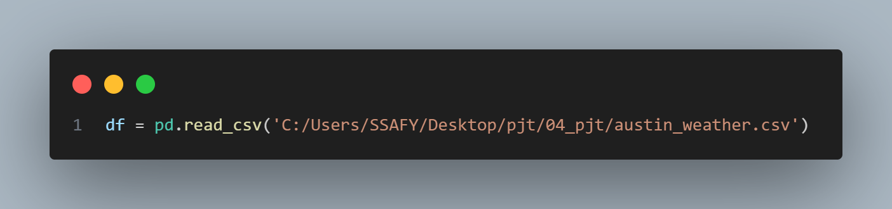
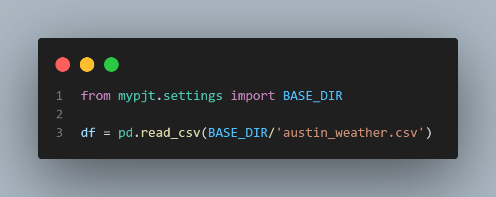

D. problem3 에서 월 별 평균 그래프를 그릴때, 각 온도 필드를 평균내다보니,x축과 y축의 데이터 길이가 맞지 않는 오류가 발생하여 Date 필드도 resample 하여 구현하는 것을 새로 배움.

E. problem4 에서 결측값들을 먼저 no events 로 바꾸는 과정에서 오류가 발생하여,  비어있는 필드 자체로 카운트를 한 다음, 마지막에 딕셔너리 key를  no events 로 바꿔줌. 이후 zip을 사용하여 key와 value 값을 따로 출력하는 구현 방식을 사용함.

추가.

엑셀의 경로를 절대경로로 설정하면 로컬마다 경로가 다를 수 있으므로, BASE_DIR 을 사용하여 상대경로로 바꿔줌.

느낀점 : 데이터 사이언스를 오랜만에 해서 헷갈리는 부분이 많았고, 몰랐던 방식을 새로 알게 되었다. 다시 데이터 사이언스 공부를 따로 더 해야겠다.