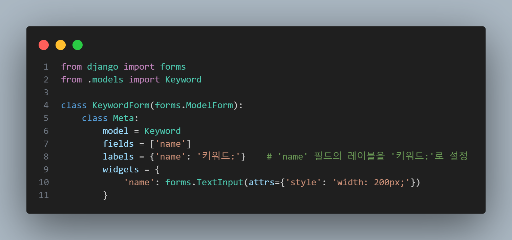
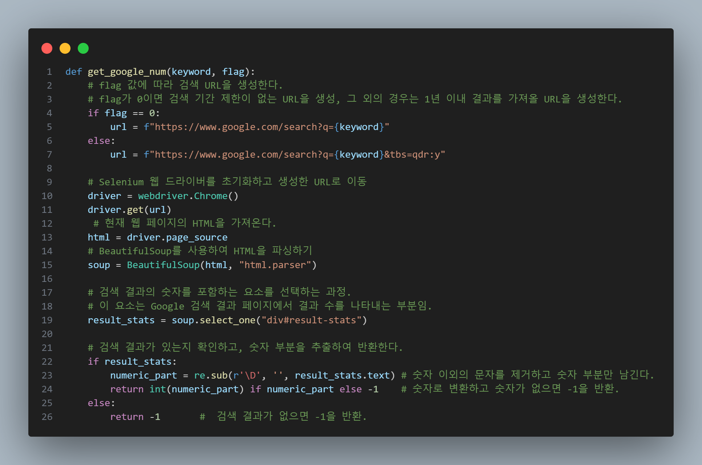
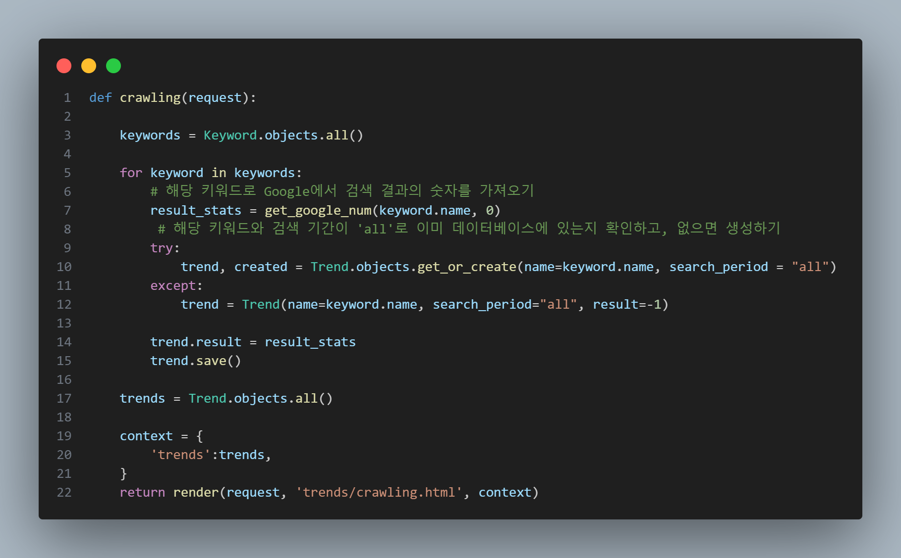

1. keyword를 입력 받을 form을 생성한다.

2. 구글에서 크롤하기 

검색 건수(result)는 IntegerField이므로 정수 부분만 추출하는 방법을 새롭게 알게됨.

이미 존재하는 데이터는 업데이트하기. 
📌 <strong>get_or_create()</strong> : 모델 객체를 생성할 때 이미 있는 객체라면 가져오고, 없으면 생성하는 QuerySet API. (object, created) 라는 튜플 형식으로 반환 -> object : 꺼내려고 하는 모델의 인스턴스(객체), created : boolean flag.

📢 느낀점 : 크롤링이 처음이다 보니, 구현하는 과정부터 어려운 점이 있었다. 크롤링 하는 방법에 대해 조금 더 코드를 보며 익혀야 할 것 같다.   