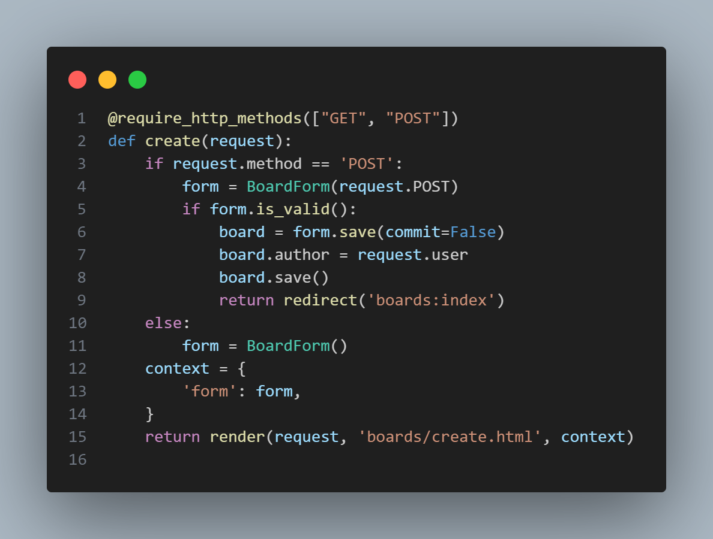
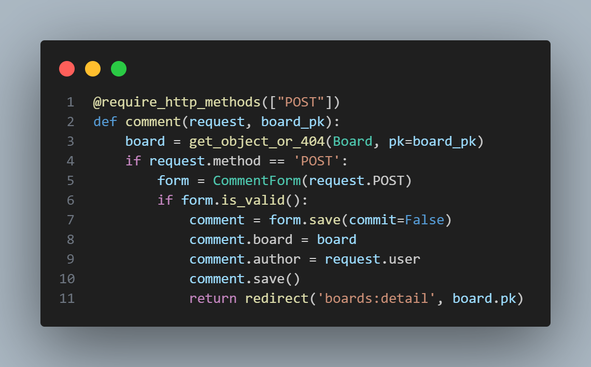
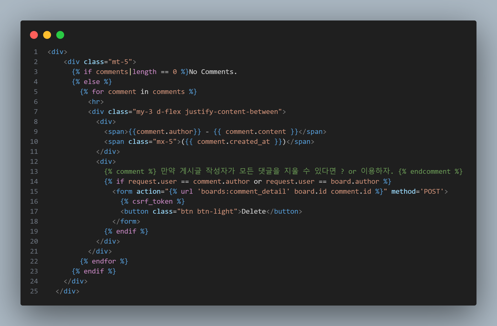

##### <---- accounts > views.py ---->  

📌 commit = False 후에 "author" 꼭 지정할 것!

 

##### <----- boards > detail.html ---->

📌 
 
게시글 작성자가 게시글의 모든 댓글을 삭제할 수 있도록 "or"을 이용하여 "request.user == board.author" 추가.

 

####
📢 느낀점 : 기본적인 게시판을 구현하는 점에서는 힘들지 않았지만, 추가적으로 기능을 구현하고 웹 페이지 디자인을 하는 부분에서 많은 시간이 걸렸다. CSS 에 대해 부족함을 느꼈다.