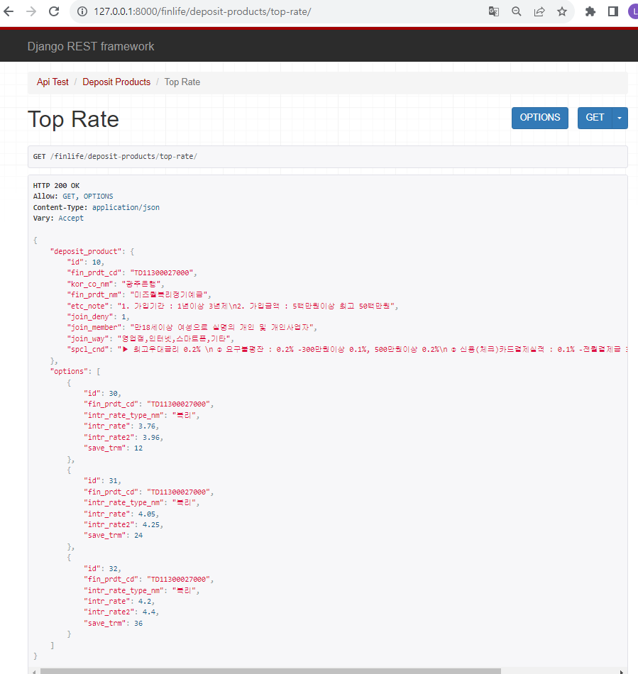

# 프로젝트 소개
> 관통 07_pjt. 금융 상품 데이터를 활용한 REST API Server 구축

**목표** : 정기예금 데이터를 활용한 REST API Server 구축하기

**특징** : 금융감독원 API를 활용한 데이터 수집
> 1. requests 모듈을 사용하여 외부 API (금융상품통합비교공시 API)를 통해 데이터를 가져오기.
> 2. 다양한 API 중 '정기예금 API' 를 활용.
> 3. Postman 또는 Chrome Browser를 이용하여 결과 확인.   

**팀원** : 오유진


<br>

# 프로젝트 구조
## 개발 환경
- python 3.9 +
- Django 4.2.6
- restframework 3.14.0

## 사용한 app framework
- Django REST framework (DRF)


## 요구 사항
A. 기본 세팅
> 1. 가상환경 생성 후 requirements.txt 를 참조하여 라이브러리 설치
> 2. pjt, app 생성 후 setting
> 3. Model, URL, View, Serializer(데이터를 JSON 형태로 변환하기 위함) 작성

<---models.py--->


클래스명 :DepositProducts
| 필드명          | 데이터 유형        | 역할                  |
|------------------|-------------------|-----------------------|
| fin_prdt_cd      | text (unique)     | 금융 상품 코드       |
| kor_co_nm        | text              | 금융회사명             |
| fin_prdt_nm      | text              | 금융 상품명           |
| etc_note         | text              | 금융 상품 설명        |
| join_deny        | integer           | 가입 제한 (1: 제한없음, 2: 서민전용, 3: 일부제한) |
| join_member      | text              | 가입 대상              |
| join_way         | text              | 가입 방법              |
| spcl_cnd         | text              | 우대조건               |

클래스명: DepositOptions
| 필드명              | 데이터 유형        | 역할                      |
|----------------------|-------------------|---------------------------|
| product              | 외래 키           | 외래 키 (DepositProducts 클래스 참조) |
| fin_prdt_cd          | text              | 금융 상품 코드             |
| intr_rate_type_nm    | varchar(100)      | 저축금리 유형명           |
| intr_rate            | float             | 저축금리                  |
| intr_rate2


<---urls.py--->
| URL 패턴                                  | view 함수                         | 이름                  |
|-----------------------------------------|----------------------------|------------------------|
| `finlife/`                                     | `api_test`                  | `api_test`            |
| `finlife/save-deposit-products/`               | `save_deposit_products`     | `save_deposit_products`|
| `finlife/deposit-products/`                    | `deposit_products`          | `deposit_products`     |
| `finlife/deposit-products/<str:fin_prdt_cd>/` | `deposit_product_options`   | `deposit_product_options`|
| `finlife/deposit-products/top-rate/`          | `top_rate`                  | `top_rate`             |


<---views.py--->
| View 함수                | View Method             | 역할                                                     | 허용 HTTP Method  |
|-------------------------|-------------------------|----------------------------------------------------------|-------------------|
| `save_deposit_products` | GET                     | 정기예금 상품 목록 데이터를 가져와 정기예금 상품 목록과 옵션 목록을 DB에 저장 | GET               |
| `deposit_products`      | GET, POST               | 전체 정기예금 상품 목록 반환 및 상품 데이터 저장                | GET, POST         |
| `deposit_product_options` | GET                   | 특정 상품의 옵션 리스트 반환                                 | GET               |
| `top_rate`              | GET                     | 가입 기간에 상관없이 금리가 가장 높은 상품과 해당 상품의 옵션 리스트 출력 | GET               |


<---serializers.py--->
| Serializer           | 역할                                           | 설정                                                                                      |
|-----------------------------|----------------------------------------------|-------------------------------------------------------------------------------------------|
| `DepositProductsSerializer` | DepositProducts 모델 사용                   | 모든 필드를 사용하도록 설정                                                               |
| `DepositOptionsSerializer`  | DepositOptions 모델 사용                    | 외래키로 설정된 `fin_prdt_cd` 필드는 읽기전용으로 설정, 모든 필드를 사용하도록 설정     |


 B. 기능 구현
> 1. 정기예금 API로부터 전달받은 데이터 중 product 목록 정보와 option 목록 정보를 DB에 저장
> 2. 전체 정기예금 상품 목록 출력
> 3. 정기예금 상품 추가하기
> 4. 특정 상품의 옵션 리스트 출력
> 5. 금리가 가장 높은 상품의 정보 출력

c. 상세 

```python
# 1. 정기예금 상품 목록 및 옵션 목록 저장
@api_view(['GET'])
def save_deposit_products(request):
    API_KEY= settings.API_KEY
    url = f'http://finlife.fss.or.kr/finlifeapi/depositProductsSearch.json?auth={API_KEY}&topFinGrpNo=020000&pageNo=1'
    
    # API로부터 데이터를 가져와 JSON 형식으로 파싱
    response = requests.get(url).json()

    ## product
    for li in response.get('result').get('baseList'):
        save_data = {
            'fin_prdt_cd' : li.get('fin_prdt_cd'),
            'kor_co_nm' : li.get('kor_co_nm'),
            'fin_prdt_nm' : li.get('fin_prdt_nm'),
            'etc_note' : li.get('etc_note'),
            'join_deny' : li.get('join_deny'),
            'join_member' : li.get('join_member'),
            'join_way' : li.get('join_way'),
            'spcl_cnd' : li.get('spcl_cnd')
        }
        serializer = DepositProductsSerializer(data=save_data)
        if serializer.is_valid():
            serializer.save()

 
    ## option
    for li in response.get('result').get('optionList'):
        product = DepositProducts.objects.get(fin_prdt_cd=li.get('fin_prdt_cd'))
        save_data = {
            'fin_prdt_cd' : li.get('fin_prdt_cd'),
            'intr_rate_type_nm' : li.get('intr_rate_type_nm','') or '',
            'intr_rate' : li.get('intr_rate',-1) or -1,
            'intr_rate2' : li.get('intr_rate2', -1) or -1,
            'save_trm' : li.get('save_trm', -1) or -1,        
            }


        serializer = DepositOptionsSerializer(data=save_data)
        if serializer.is_valid():
            # 옵션 데이터를 상품과 연결하여 저장
            serializer.save(product = product)
    
    return Response({'message':'okay'})

```


```python
# 2. 전체 정기예금 상품 목록 출력
# 3. 정기예금 상품 추가하기
@api_view(['GET','POST'])
def deposit_products(request):
    # GET 요청 처리: 정기예금 상품 목록 조회
    if request.method == 'GET':
        products = get_list_or_404(DepositProducts)
        serializer = DepositProductsSerializer(products, many=True)
        return Response(serializer.data)
    
    # POST 요청 처리: 새로운 정기예금 상품 생성
    elif request.method == 'POST':
        serializer = DepositProductsSerializer(data=request.data)
        if serializer.is_valid(raise_exception=True):
            serializer.save()
            return Response(serializer.data, status=status.HTTP_201_CREATED)

```


```python
# 4. 특정 상품의 옵션 리스트 출력
@api_view(['GET'])
def deposit_product_options(request, fin_prdt_cd):
    options = get_list_or_404(DepositOptions, fin_prdt_cd = fin_prdt_cd)
    serializer = DepositOptionsSerializer(options, many=True)
    return Response(serializer.data)

```


```python
# 5. 금리가 가장 높은 상품의 정보 출력
@api_view(['GET'])
def top_rate(request):
    # "최고 우대 금리" 가 가장 높은 옵션 찾기
    highest_option = DepositOptions.objects.all().order_by('-intr_rate2').first()

    # "최고 우대 금리" 가 가장 높은 상품의 정보와 옵션 리스트를 반환
    product = DepositProducts.objects.get(pk= highest_option.product.pk)
    options = DepositOptions.objects.filter(fin_prdt_cd= highest_option.fin_prdt_cd)

    option_serializer = DepositOptionsSerializer(options, many= True)
    product_serializer = DepositProductsSerializer(product)

    response_data = {
        'deposit_product': product_serializer.data,
        'options': option_serializer.data
    }

    return Response(response_data)
    
```


## 참고 사항
**환경변수 관리**
- API KEY 와 같이 외부에 노출하면 안되는 정보를 따로 관리.
- django-environ 설치. -> (venv) $ pip install django-environ
- .env 파일 작성
  - 발급받은 API KEY 를 따옴표로 묶어서 문자열 형태로 입력. -> API_KEY="발급받은 API KEY"
  - 이때, API_KEY와 = 사이에 공백이 있으면 오류 발생.
  - 또한, 수정 후 서버를 다시 시작해야 반영됨.
- settings.py 에 다음 코드 추가.
  ```python 
  # Build paths inside the project like this: BASE_DIR / 'subdir'.
  BASE_DIR = Path(__file__).resolve().parent.parent
 
  import os
  import environ

  # 환경변수를 불러올 수 있는 상태로 설정
  env = environ.Env(DEBUG=(bool, True))

  # 읽어올 환경 변수 파일을 지정
  environ.Env.read_env(
    env_file = os.path.join(BASE_DIR, '.env')
  )

  # 설정한 변수를 읽어옴
  API_KEY = env('API_KEY')
  ```
- settings에 등록한 환경변수는 views.py에서 다음과 같이 사용
  ```python
  from django.conf import settings

  API_KEY = settings.API_KEY
  ```


## 데이터베이스 ERD


## 문제해결

- 마지막 기능 구현에서 자꾸 위와 같은 오류가 발생하였다. 서치해보니 렌더러 설정 문제였는데,
DRF에서는 응답을 렌더링하기 위해 렌더러(Renderer)를 사용하며 @api_view 를 사용하지 않으면 렌더러가 자동으로 설정되지 않을 수 있으므로 다음과 같은 오류가 발생할 수 있다.
- @api_view 데코레이터를 사용하면 API 뷰로 함수를 정의하고 필요한 처리를 자동으로 수행할 수 있다. 
- 따라서 API 뷰로 사용하는 함수에서는 일반적으로 @api_view 데코레이터를 사용하여 필요한 HTTP 요청 유형을 지정하고, 인증, 권한, 렌더러 설정 등을 자동으로 처리할 수 있도록 하는 것이 좋다.


# 회고
이전 프로젝트에 비해 디버깅하는데에 시간을 오래쓴 것 같다. 그 만큼 코드를 꼼꼼하게 구현하지 못했던 것 같다. 또한 DRF에 대해 직접적으로 와닿지 않는 부분들에 대해서는 추가적으로 공부가 
필요함을 느꼈다. 

