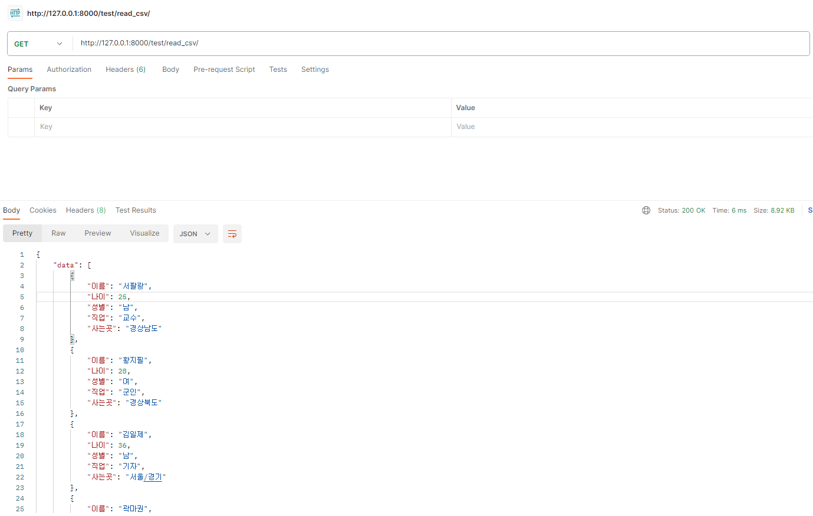
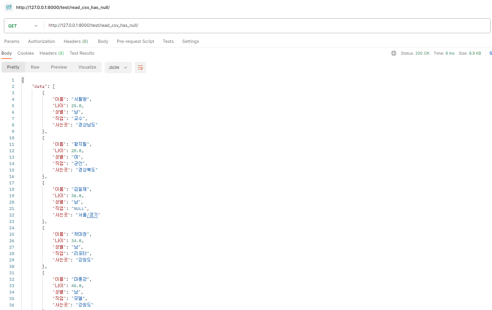
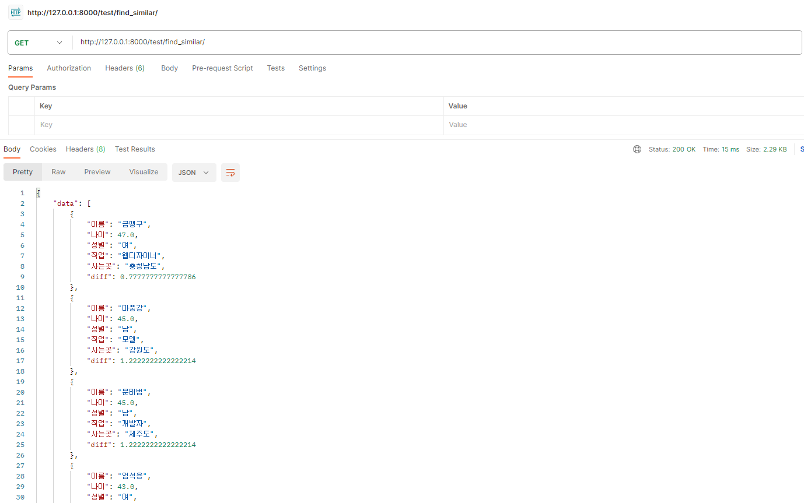
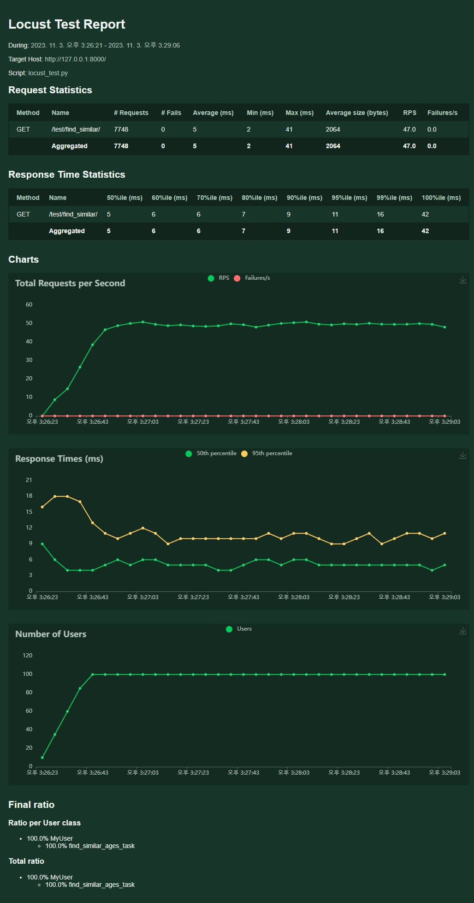
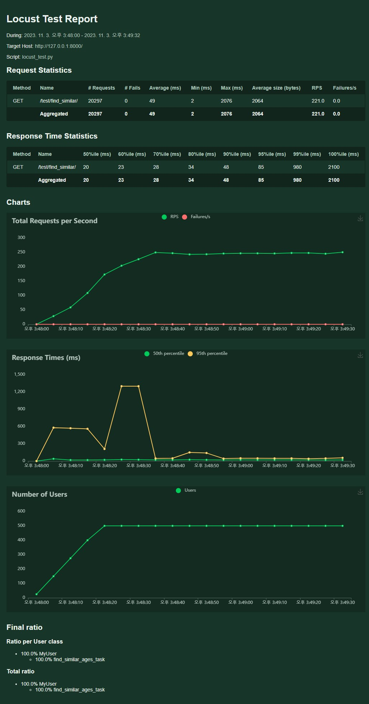
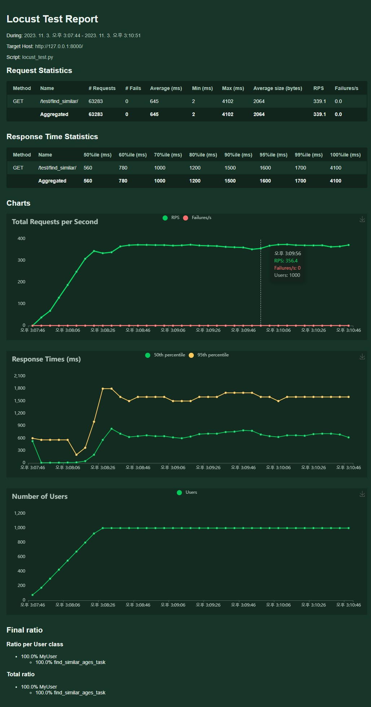
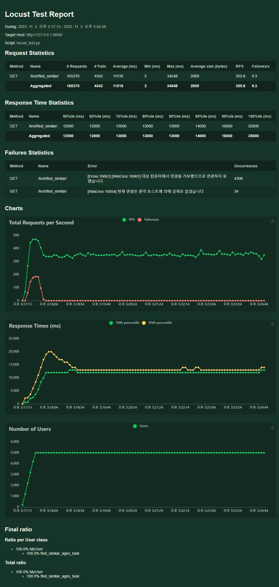

# 프로젝트 소개
> 관통 08_pjt. 알고리즘 구현 및 성능 측정

- 목표 
  - Django 에서 요구사항에 따라 알고리즘을 구현해보고 구현한  Locust 라는 툴을 이용하여 알고리즘의 성능을 측정한다.

- 특징 
  - Pandas 라이브러리를 활용한 데이터 처리
  - Locust 를 활용한 알고리즘 성능 측정


- 팀원
  - 오유진


<br>

# 프로젝트 구조
## 개발 환경
- python 3.9 +
- Django 4.2.6
- Django REST framework (DRF) 3.14.0

## 사용한 라이브러리
- Numpy
- Pandas 
- Matplotlib

## 성능 테스트 환경
- 성능 테스트 도구: Locust
- Locust 버전: 2.17.0
- 테스트 환경: [여기에 테스트 환경에 대한 정보를 작성합니다. 예를 들어, 사용한 컴퓨터 스펙, 운영 체제 등]


## 진행 순서
1. 테스트 & 성능 테스트 개념
2. Locust 세팅
3. 알고리즘 성능 측정 실습  


## 요구 사항
**1,2,3 요구 사항에 따라 URL 패턴과 이에 매칭되는 View 함수를 각각 구현한다.**
1. CSV 데이터를 DataFrame 으로 변환 후 반환
2. 결측치 처리 후 데이터 변환
3. 알고리즘 구현하기(평균 나니와 가장 비슷한 10명)
4. Locust 를 활용한 알고리즘 성능 측정


## 구현 상세 

<---urls.py--->
| URL 패턴          | view 함수                             | name                  |
|------------------|-----------------------------------|------------------------|
| `test/read_csv/`      | `views.csv_return_json`  | `read_csv`              |
| `test/read_csv_has_null/` | `views.csv_return_json_has_null` | `read_csv_has_null` |
| `test/find_similar/` | `views.find_similar`        | `find_similar`     |

<br>

<---views.py--->
```python 
# A. CSV 데이터를 DataFrame 으로 변환 후 반환
# B. 결측치 처리 후 데이터 반환

# CSV 파일을 직접 열고 Pandas DataFrame으로 변환
def csv_to_dataframe(csv_path):
    try:
        df = pd.read_csv(csv_path, encoding='euc-kr')
        # 결측치를 "NULL" 문자열로 치환 
        df.fillna("NULL", inplace=True)
        return df
    except Exception as e:
        print("An error occurred while reading the CSV file:", str(e))
        return None


# Django 뷰 함수에서 데이터를 읽어와서 JSON 응답 반환
def csv_return_json(request):
    csv_path = BASE_DIR/"data/test_data.CSV"
    df = csv_to_dataframe(csv_path)

    if df is not None:
        data = df.to_dict('records')
        return JsonResponse({'data': data})
    else:
        return JsonResponse({'error': 'Failed to read CSV data into a DataFrame'}, status=500)


def csv_return_json_has_null(request):
    csv_path = BASE_DIR/"data/test_data_has_null.CSV"
    df = csv_to_dataframe(csv_path)

    if df is not None:
        data = df.to_dict('records')
        return JsonResponse({'data': data})
    else:
        return JsonResponse({'error': 'Failed to read CSV data into a DataFrame'}, status=500)
```

**결측치를 "NULL 문자열로 치환 하기 위해, 함수 csv_to_dataframe 에 `df.fillna("NULL", inplace=True)` 추가함.**

**또한, 함수 `csv_return_json` 와 함수 `csv_return_json_has_null` 은 각각 다른 CSV 를 사용하였음.**


<--- 요청 결과 확인 ---> 
- http://127.0.0.1:8000/test/read_csv/ 요청 결과



- http://127.0.0.1:8000/test/read_csv_has_null/ 요청 결과

 

- http://127.0.0.1:8000/test/find_similar/ 요청 결과




```python
# C. 알고리즘 구현하기(평균 나이와 가장 비슷한 10명 구하기)


csv_path = BASE_DIR /"data/test_data_has_null.CSV"
df = csv_to_dataframe(csv_path)
df = df.dropna(subset=['나이'])

# '나이' 필드에서 NaN 값을 가지고 있지 않은 행을 선택
df['나이'] = pd.to_numeric(df['나이'], errors='coerce')

# 각 행의 나이와 평균 나이와의 차이를 계산하여 새로운 필드를 만듭니다.
df_avg = df['나이'].mean()

def find_similar(request):
    avg = df_avg
    df['diff'] = abs(df['나이'] - avg)

    # '나이_차이' 필드를 기준으로 가장 작은 10개의 행을 선택
    similar_ten = df.nsmallest(10, 'diff')

    # JSON 형태로 응답
    data = similar_ten.to_dict('records')
    return JsonResponse({'data': data})
```

**DataFrame 을 전역 변수로 선언하여 문제 해결하였음.**


```python
# D. Loucst 를 활용한 알고리즘 성능 측정

# Locust test script 작성 
from locust import HttpUser, task, between

class MyUser(HttpUser):
    wait_time = between(1, 3) 

    @task
    def find_similar_ages_task(self):
        self.client.get("test/find_similar_ages/")  
```


## 성능 테스트 결과
**다양한 시나리오와 다른 동시 접속자 수를 사용하여 성능 테스트를 수행한 결과 요약**

- case 1. 
  - 총 접속자 수: 100
  - 동시 접속자 수: 5
  - 평균 RPS: 47
  - 평균 응답 시간: 5ms
  - 

- case 2. 
  - 총 접속자 수: 500
  - 동시 접속자 수: 25
  - 평균 RPS: 49
  - 평균 응답 시간: 221ms
  - 

- case 3. 
  - 총 접속자 수: 1000
  - 동시 접속자 수: 25
  - 평균 RPS: 367.1
  - 평균 응답 시간: 645ms
  - 

- case 4.
  - 총 접속자 수: 5000
  - 동시 접속자 수: 200
  - 평균 RPS: 355.8
  - 평균 응답 시간: 11516ms
  - 
  


## 성능 테스트 비교
**실행결과는 따로 확인하였다. 나와 다르게 대부분 for문을 사용하여 구현하였는데, 이는 성능테스트에서 생각보다 좋은 결과를 가져오지는 않았다.**

- 김영일
  ```python
  def ageDataFrame(request):
      df = getDataFrame()

      age_avg = 0
      person = 0
      for age in df['나이']:
          if age != 'NULL':
              age_avg += age
              person += 1

      age_avg /= person
      
      diff = [[21e8,-1] for _ in range(len(df))]
      for i in range(len(df)):
          diff[i][1] = i
          if df['나이'][i] != 'NULL':
              diff[i][0] = abs(age_avg - df['나이'][i])

      df['diff'] = [0]*len(df)
      for i in range(len(df)):
          df['diff'][i] = diff[i][0]

      diff.sort()
      
      data = df.to_dict('records')
      new_data = []
      for i in range(10):
          new_data.append(data[diff[i][1]])

      return JsonResponse({"dat": new_data})
  ```


- 오민상
  ```python
  import pandas as pd
  from django.http import JsonResponse
  # from rest_framework.decorators import api_view

  csv_path = 'data/test_data_has_null.CSV'

  # df 생성
  def DF():
      df = pd.read_csv(csv_path, encoding='euc-kr')
      df.fillna('NULL', inplace=True)
      return df
      

  # df 출력
  @api_view(['GET'])
  def Getdataframe(request):
      df = DF()
      data = df.to_dict('records')
      return JsonResponse({'dat': data})

  # 10명 추출
  @api_view(['GET'])
  def Agedataframe(request):
      df = DF()
      Age_avg, Person = 0, 0
      for age in df['나이']:
          if age != 'NULL':
              Age_avg += age
              Person += 1
      Age_avg /= Person
      
      diff = []
      for age in df['나이']:
          if age != 'NULL':
              ans = abs(Age_avg - age)
              diff.append(ans)
          else:
              diff.append(None)
      df['diff'] = diff
      df = df.sort_values(by='diff')
      new_df = df.iloc[0:10]
      data = new_df.to_dict('records')
      return JsonResponse({"dat": data})
  ```


- 윤주찬
  ```python
  # 1번과제 데이터 불러오기 csv 파일을 utf-8형식으로 변환하거나 read_csv 메소드에 encoding인자를 euc-kr로 설정
  # df = pd.read_csv('data/test_data.CSV')
  df = pd.read_csv('data/test_data_has_null.CSV', encoding='euc-kr')

  # 2번과제 데이터 전처리
  # inplace인자를 True로 하여 현재 데이터 프레임 정보 수정
  df.columns = ['name', 'age', 'sex', 'job', 'address']
  for column in df.columns :
          df[column].fillna('NULL', inplace=True)

  # 3번과제 평균나이 구하기
  age = df['age']
  age.drop(age[df['age'] == 'NULL'].index, inplace=True)
  age_mean = age.mean()
  df['diff'] = df['age']
  df['diff'] = df[df['age'] != 'NULL']['diff'].apply(lambda x : abs(x - age_mean))
  target = df.sort_values(by='diff', ascending=True)[:10]
  ```


- 오유진
  ```python
  @api_view(['GET'])
  def yujin_pjt08(request):
      columns = ['이름', '나이', '성별', '직업', '사는곳']
      df = pd.read_csv(file_path, encoding='cp949', usecols=columns)
      df = df.fillna("NULL")

      total = 0
      cnt = 0
      for index, row in df.iterrows():
          if row['나이'] != "NULL":
              cnt += 1
              total += int(row['나이'])
      avg =  total / cnt

      arr = []
      for index, row in df.iterrows():
          if row['나이'] == "NULL":
              arr.append(21e8)
          else:
              arr.append(abs(int(row['나이']) - avg))
      df['diff'] = arr    
      result = df.nsmallest(10, 'diff').to_dict(orient='records')
      return JsonResponse({'dat': result})
  ```

- 조현호


## 참고 사항
- records 옵션을 사용하여 JSON 응답 생성.
  - DataFrame을 반환할 때 records 옵션을 사용하여 JSON 응답을 생성한다.
```python
# records : 리스트 원소를 각각 하나의 레코드로 만들기 위해 주는 옵션
data = df.to_dict('records')

# JSON 형태로 응답.
return JsonResponse({'data' : data})
```

- Locust 사용법
  1. 테스트 스크립트 작성하기
  2. Django 서버 실행 
  3. 터미널 추가 & Locust 설치 및 실행
      - `(venv) $ pip install locust` 
      - `(venv) $ locust –f ./locust_test.py`
  4. 웹 실행 ("http://localhost:8089/" 점속)
  5. 결과 확인 (콘솔 종료 후 요청에 대한 분석을 콘솔에서 확인 가능)


<br>

# 회고
## 문제해결
**CSV 파일 인코딩 에러**
```python
# encoding='euc-kr' 를 추가함으로써 해결
df = pd.read_csv(csv_path, encoding='euc-kr')
```


## 새롭게 습득한 내용
> `df.nsmallest(n, columns)` : Pandas DataFrame에서 n개의 가장 작은 값을 가진 행을 선택하는 메서드. 여기에서 n은 원하는 행의 수를 나타내며, columns은 어떤 열을 기준으로 가장 작은 값을 찾을 것인지를 나타낸다.
>
> `Locust` : python으로 작성된 성능 테스트 도구로, 대규모 사용자 부하를 시뮬레이션하여 웹 애플리케이션의 성능을 측정.


## 느낀점
> Django 프로젝트명, 앱 이름을 수정하여 다시 만들어야 할 것 같다.
> 
> 테스트 결과를 기반으로 성능 향상을 위한 다양한 조치를 취해야할 것 같다. 성능 문제 및 병목 현상을 식별하고 최적화를 수행하도록 해야한다.
>
> 총 접속자 수가 많을수록 초기에 FAILURES 가 높다가 Requests가 많아질수록 점차 0으로 수렴하는데, 다른 사람들이 구현한 알고리즘과 비교하여 이를 해결할 방법을 찾을 예정이다.
>
> 이번 프로젝트의 구현은 어렵지 않았다. 아직도 모르는 Pandas의 문법이 많은 것 같다. 꼭 Numpy 과 Pandas 학습을 더 해야한다. 그리고 처음 써보는 Locust 도 앞으로 자주 사용할 수 있도록 익숙해질 수 있게 노력해야겠다. 